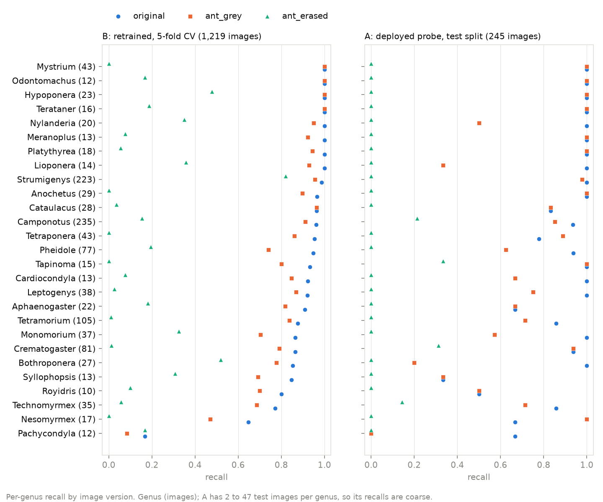

# Masking experiment: does the model classify from the ant?

Each image was embedded again in four versions: the original, the ant
alone on grey, the image with the ant erased, and the image with the scale
bar erased. Genus was then predicted with the deployed probe and with a
probe retrained on each version.

## Conclusion

1. The model classifies from the ant. With the ant erased, the deployed probe falls to chance (macro-F1 0.029 against 0.877), and even a probe retrained on erased images reaches only 0.122, the level of the metadata-only classifier of `reports/confounds/README.md` (0.120).
2. The photo setup carries a Strumigenys signal that a probe can learn (recall 0.821 on erased images, B), but the deployed probe does not use it (recall 0.000 on erased images, 1.000 with the scale bar erased).
3. The ant alone on grey costs 0.18 macro-F1 with the deployed probe and 0.09 when retrained. The largest drops are in small look-alike genera (Pheidole, Nesomyrmex, Monomorium, Syllophopsis, Tapinoma), whose masks are as complete as the others. This fits the unfamiliar grey background pushing close calls across, not mask quality.
4. The background does not explain the gaps for GBIF-cache crops and for backgrounds atypical for the genus: both gaps persist with the ant isolated, and on erased images neither group is easier.

## Method

| Version | Image | File |
|---|---|---|
| original | the image as used by the POC, embedded again | `data/images/<genus>/<stem>.jpg` |
| ant_grey | the masked ant on uniform grey (128, 128, 128) | `data/segmented/<genus>/<stem>_ant_grey.png` |
| ant_erased | the ant erased (mask dilated by 15 px, filled with the border colour) | `<stem>_ant_erased.png` |
| scalebar_erased | the scale bar erased the same way; the 30 images with no scale bar found use the original | `<stem>_scalebar_erased.png` |

Masks and derived images come from `scripts/27_segment_all.py`
(`reports/segmentation/README.md`).

- **Images.** 1,219 of 1,236: the 17 with exclude=1 in `reports/segmentation/exclude.csv` are left out. The 28 partial masks and 7 detail images are kept, marked in `data/masking/embeddings_index.csv`, and dropped in a sensitivity run.
- **Embeddings.** `scripts/30_embed_variants.py`: the model and preprocessing of `scripts/06_embed.py` (BioCLIP 2 at the pinned revision, L2-normalised), on MPS, batch size 64 (64 ran at 8.2 images/s against 4.9 for 32 in the timing test).
- **Identity check.** The re-embedded originals match `data/embeddings.npy`: cosine median 1.000000000, minimum 0.999999821, largest difference in any value 3.7e-06. MPS does not change the embeddings.
- **A, deployed probe.** `data/probe.pkl`, unchanged, predicts the 245 test-split images of each version. 95 % intervals from 1,000 bootstrap resamples, seed 42.
- **B, retrained.** The protocol of `scripts/22_metadata_only_classifier.py` for its embedding row: logistic regression (C=1, balanced class weights), 5-fold stratified CV, seed 42, trained and tested on the same version, all 1,219 images.

## Scores

`scores.csv`. Chance levels from `reports/confounds/README.md` (1,236 images, 5-fold CV).

| Version | A macro-F1 [95 % CI] | A accuracy [95 % CI] | B macro-F1 | B accuracy |
|---|---|---|---|---|
| original | 0.877 [0.786, 0.926] | 0.927 [0.890, 0.955] | 0.863 | 0.928 |
| ant_grey | 0.694 [0.600, 0.752] | 0.812 [0.759, 0.865] | 0.773 | 0.862 |
| ant_erased | 0.029 [0.015, 0.045] | 0.069 [0.037, 0.106] | 0.122 | 0.253 |
| scalebar_erased | 0.848 [0.756, 0.898] | 0.914 [0.873, 0.947] | 0.858 | 0.921 |
| *Without partial and detail images (236 / 1,184 images):* | | | | |
| original | 0.869 [0.768, 0.918] | 0.928 [0.894, 0.958] | 0.860 | 0.920 |
| ant_grey | 0.704 [0.608, 0.761] | 0.826 [0.780, 0.877] | 0.788 | 0.867 |
| ant_erased | 0.028 [0.013, 0.044] | 0.064 [0.034, 0.097] | 0.112 | 0.241 |
| scalebar_erased | 0.831 [0.738, 0.885] | 0.915 [0.877, 0.949] | 0.867 | 0.924 |
| Chance: always the majority genus | 0.012 | 0.193 | 0.012 | 0.193 |
| Chance: random with class priors, 99th percentile | 0.049 | 0.122 | 0.049 | 0.122 |

A on the originals (0.927 accuracy, 0.877 macro-F1) is close to the POC
test result (0.928, 0.885 on 250 images); the gap is the 5 excluded test
images. Dropping the partial and detail images changes no conclusion.

## Breakdown

`breakdown.csv`, per-genus recall in `per_genus.csv`.



### 1. Which genera lose most with the ant alone, and why?

B recall, original minus ant_grey, the 5 largest drops. Metadata-only
recall is the random forest of `reports/confounds/metadata_only_per_genus.csv`.

| Genus | Images | Original | ant_grey | Drop | ant_erased | Metadata only | Median mask area | Partial |
|---|---|---|---|---|---|---|---|---|
| Pheidole | 77 | 0.948 | 0.740 | 0.208 | 0.195 | 0.321 | 0.334 | 2 |
| Nesomyrmex | 17 | 0.647 | 0.471 | 0.176 | 0.000 | 0.118 | 0.321 | 0 |
| Monomorium | 37 | 0.865 | 0.703 | 0.162 | 0.324 | 0.162 | 0.264 | 0 |
| Syllophopsis | 13 | 0.846 | 0.692 | 0.154 | 0.308 | 0.286 | 0.299 | 0 |
| Tapinoma | 15 | 0.933 | 0.800 | 0.133 | 0.000 | 0.133 | 0.299 | 0 |

Neither explanation offered fits well; the evidence is against mask quality.

- **Mask quality.** Mask areas are typical (median 0.321 over all genera). 2 of these 159 images are rated partial, and the 6 of them in the hand check are rated good. On the QA sheets (`reports/segmentation/qa/Pheidole_1.jpg`, `Monomorium_1.jpg`, `Nesomyrmex_1.jpg`, `Tapinoma_1.jpg`) antennae, legs, spines and petioles are kept; the masks err towards keeping card and glue. Within a genus, smaller masks do only slightly worse (Pheidole 0.71 against 0.77).
- **Context.** Erased-ant recall is 0 for Nesomyrmex and Tapinoma and at most 0.32 for the others, and the metadata-only recall is low for all five.
- **What fits.** The ant_grey errors go to other small genera of similar build: Crematogaster, Royidris, Syllophopsis, Cardiocondyla. These genera have the narrowest margins, so a background new to the model is enough to tip them.

### 2. Does the setup alone identify Strumigenys?

| Version | A recall (45 test images) | B recall (223 images) |
|---|---|---|
| original | 1.000 | 0.986 |
| ant_grey | 0.978 | 0.955 |
| ant_erased | 0.000 | 0.821 |
| scalebar_erased | 1.000 | 0.978 |

A probe trained on erased images finds 183 of the 223 Strumigenys, but also
calls 63 images of other genera Strumigenys (precision 0.74). The deployed
probe finds none of them on erased images and loses nothing when the scale
bar is erased: it does not use the setup.

### 3. Do image source and background explain the accuracy gaps?

Accuracy. Counts are A test images / B images.

| Group | A original | A ant_grey | A ant_erased | B original | B ant_grey | B ant_erased |
|---|---|---|---|---|---|---|
| Commons (223 / 1,114) | 0.928 | 0.825 | 0.063 | 0.938 | 0.874 | 0.252 |
| GBIF-cache crops (22 / 105) | 0.909 | 0.682 | 0.136 | 0.819 | 0.733 | 0.257 |
| Background typical for the genus (128 / 616) | 0.953 | 0.852 | 0.070 | 0.948 | 0.877 | 0.265 |
| Background atypical for the genus (117 / 603) | 0.897 | 0.769 | 0.068 | 0.907 | 0.847 | 0.240 |

Atypical background uses the definition of `reports/confounds/README.md`:
distance of the background brightness from the genus median, in genus
standard deviations, above its median over all 1,236 images.

- **Background.** The typical / atypical gap is 0.04 on the originals and 0.03 on ant_grey (B). On erased images typical backgrounds are no easier (0.265 against 0.240).
- **GBIF-cache crops.** They stay behind Commons on ant_grey (0.733 against 0.874, B), which fits the crops showing less of the ant better than a setup effect.

## Caveats

- **Grey is new to the model.** Neither BioCLIP 2 nor the probe has seen ants on flat grey, so part of the ant_grey drop is a domain shift, not lost information. ant_grey is a lower bound for what the ant alone carries.
- **The erased image keeps the ant's outline.** The ant is filled with a flat colour, so its silhouette and size remain. ant_erased is therefore an upper bound for what the background alone carries.
- **Small samples in A.** A has 245 test images, 2 to 47 per genus, and only 22 GBIF-cache crops; per-genus and per-group A figures are coarse. B covers all 1,219 images.

## Reproduce

On this Mac (Apple M5 Pro, 15 CPUs, 24 GB, torch 2.14.1 with MPS), from the
repository root, after `scripts/27_segment_all.py`:

```bash
HF_HUB_OFFLINE=1 .venv/bin/python scripts/30_embed_variants.py   # 526 s: 4 x 1,219 images at 11.3 to 11.5 images/s
.venv/bin/python scripts/31_score_variants.py                    # 8 s
.venv/bin/python scripts/32_masking_breakdown.py                 # 3 s
```

| Script | Writes |
|---|---|
| `30_embed_variants.py` | `data/masking/embeddings_<version>.npy`, `data/masking/embeddings_index.csv` (gitignored), `30_embed_variants.log` |
| `31_score_variants.py` | `scores.csv`, `per_genus.csv`, `31_score_variants.log` |
| `32_masking_breakdown.py` | `breakdown.csv`, `figures/per_genus_recall.png`, `32_masking_breakdown.log` |
